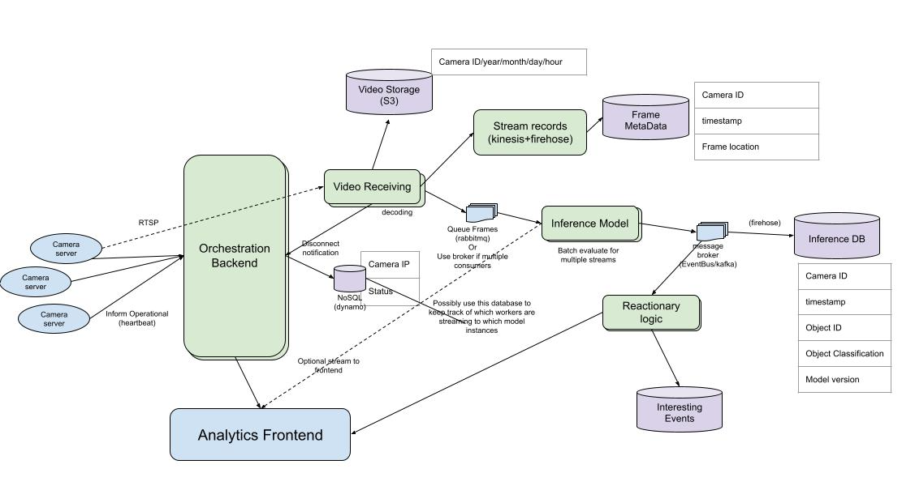

## real-time-object-processing
This project lays out thoughts on how to go about a real-time object detection system using video streams from RSTP servers. The general outline is that a device can ping the API to provide info on its streaming server. The API would then spin up a receiver whose 1st priority is to ensure no dropped frames and saving of the raw data. The collected frames then follow a more traditional
processing pipeline to an inferencing node/s. This could be too slow for realtime in which case socket communication with an orchestrating concept may be needed. However, the outlined concept makes it easy to replace services or have multiple inferencing models.

### Current existing tooling
Tools to consider for actual product usage:
- If running in a cloud service, something like AWS's [kinesis video streams](https://aws.amazon.com/kinesis/video-streams/features/?nc=sn&loc=2) is probably a good choice for storage while adding in hooks for inference tools.
- Nvidia also has [DeepStream](https://developer.nvidia.com/deepstream-sdk) which was made for this purpose as well.

### General unordered thoughts
- This repo is set up to mock the presented diagram using the following tools to help test a full system
setup:
  - [fake rtsp stream](https://github.com/insight-platform/Fake-RTSP-Stream?tab=readme-ov-file)
  - [localstack for mocking aws services](https://docs.localstack.cloud/overview/)
- SQS is used instead of rabbitmq for prototyping purposes. This requires additional S3 calls to download the stored
images instead of passing them in the message. If this framework does not acheive the real-time capability, then a UDP server can be setup (depending on criticality, TCP may be better).
- message structures between services would normally be implemented using `BaseModel` to ensure interfaces match. This is not implemented yet.
- only the **receiving service** and the **inference service** have been implemented (to a very basic degree)
- the commented out terraform code is the start to creating the firehose stream to put the classification results in an athena database.

### steps for testing
- install terraform `brew install terraform`(mac)
- start localstack `docker compose up -d` from top level
- apply terraform `tflocal apply -auto-approve` from `terraform` folder
- start streamimg some data `docker compose up` from the fake rtsp repo. (recommend doing in separate terminal)
- start the receiving service `STREAMING_SOURCE=rtsp://localhost:8554/city-traffic uv run python receive_video/__main__.py` or `STREAMING_SOURCE=rtsp://localhost:8554/local-loop make run_docker` if the docker has been built
  - optional, turn it off after a bit so the queue doesn't keep filling
  - this service would typically be spun up as a pod in k8 or task in ECS
- start the inference service `uv run python model_inference/__main__.py` or `make run_docker` if docker has been built
